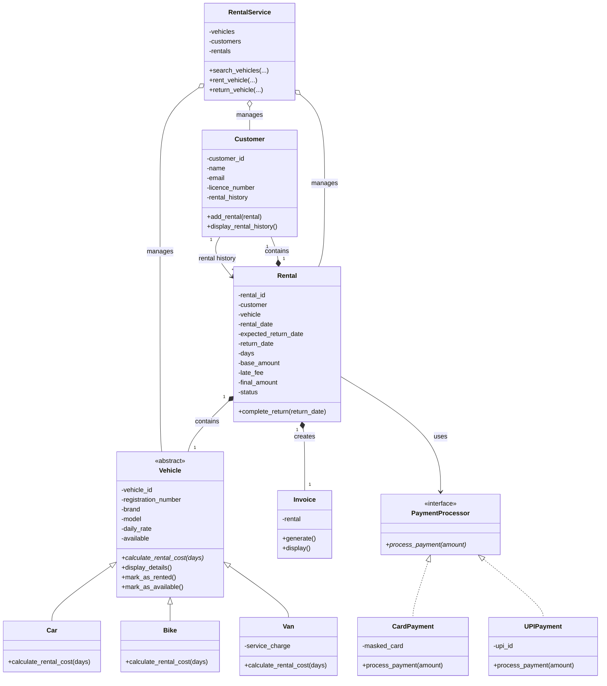

# Class Diagram

```mermaid
classDiagram
    class Vehicle {
        <<abstract>>
        -vehicle_id
        -registration_number
        -brand
        -model
        -daily_rate
        -available
        +calculate_rental_cost(days)*
        +display_details()
        +mark_as_rented()
        +mark_as_available()
    }

    class Car {
        +calculate_rental_cost(days)
    }

    class Bike {
        +calculate_rental_cost(days)
    }

    class Van {
        -service_charge
        +calculate_rental_cost(days)
    }

    class Customer {
        -customer_id
        -name
        -email
        -licence_number
        -rental_history
        +add_rental(rental)
        +display_rental_history()
    }

    class Rental {
        -rental_id
        -customer
        -vehicle
        -rental_date
        -expected_return_date
        -return_date
        -days
        -base_amount
        -late_fee
        -final_amount
        -status
        +complete_return(return_date)
    }

    class Invoice {
        -rental
        +generate()
        +display()
    }

    class PaymentProcessor {
        <<interface>>
        +process_payment(amount)*
    }

    class CardPayment {
        -masked_card
        +process_payment(amount)
    }

    class UPIPayment {
        -upi_id
        +process_payment(amount)
    }

    class RentalService {
        -vehicles
        -customers
        -rentals
        +search_vehicles(...)
        +rent_vehicle(...)
        +return_vehicle(...)
    }

    Vehicle <|-- Car
    Vehicle <|-- Bike
    Vehicle <|-- Van

    PaymentProcessor <|.. CardPayment
    PaymentProcessor <|.. UPIPayment

    Customer "1" --> "*" Rental : rental history
    Rental "1" *-- "1" Vehicle : contains
    Rental "1" *-- "1" Customer : contains
    Rental "1" *-- "1" Invoice : creates
    Rental --> PaymentProcessor : uses

    RentalService o-- Vehicle : manages
    RentalService o-- Customer : manages
    RentalService o-- Rental : manages
```
